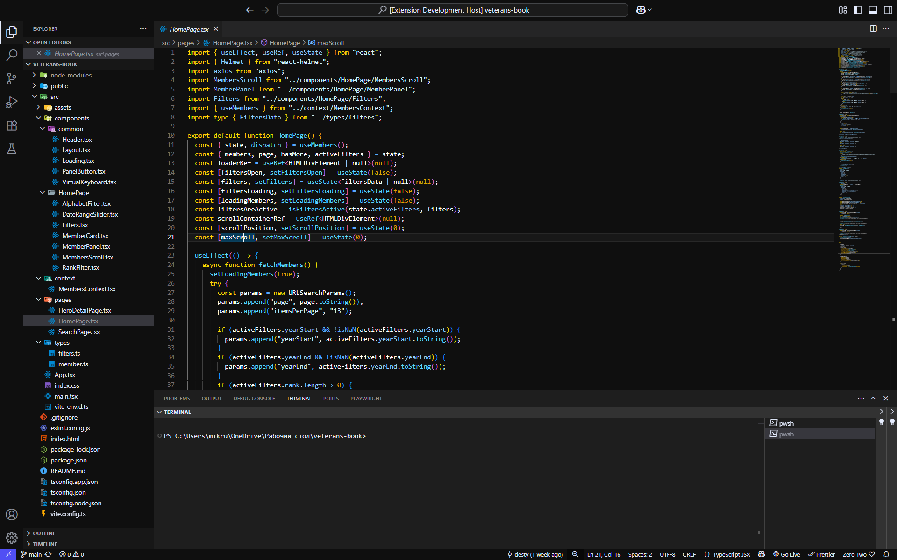
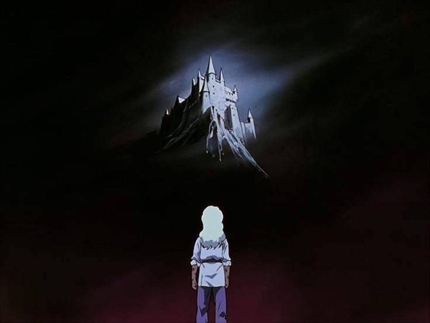

# Griffith Theme



## About Griffith Theme

Inspired by the captivating worlds of anime and fantasy, Griffith Color Theme is designed to bring a sleek, dark, and immersive atmosphere to your coding environment — combining clarity with subtle artistic flair.

Designed by [desty](https://github.com/desssty)

## Color Palette

| Palette      | Hex       | RGB             | HSL               | Preview                                                                     |
| ------------ | --------- | --------------- | ----------------- | --------------------------------------------------------------------------- |
| Background   | `#0f0f0f` | `15, 15, 15`    | `0°, 0%, 6%`      |  |
| Current Line | `#37373d` | `55, 55, 61`    | `240°, 5%, 23%`   |  |
| Selection    | `#37373d` | `55, 55, 61`    | `240°, 5%, 23%`   |  |
| Foreground   | `#e5ecfe` | `229, 236, 254` | `224°, 89%, 95%`  |  |
| Comment      | `#5d7ca7` | `93, 124, 167`  | `216°, 30%, 51%`  |  |
| Cyan         | `#5ad4ff` | `90, 212, 255`  | `196°, 100%, 68%` |  |
| Green        | `#b0eaeb` | `176, 234, 235` | `181°, 60%, 81%`  |  |
| Yellow       | `#ffcc00` | `255, 204, 0`   | `48°, 100%, 50%`  |  |
| Red          | `#a54445` | `165, 68, 69`   | `359°, 42%, 46%`  |  |
| Purple       | `#5aaaff` | `90, 170, 255`  | `212°, 100%, 68%` |  |

## Installation

1. Clone this repository:

```bash
git clone https://github.com/desssty/griffith-theme.git
```

2. Copy the folder to your VS Code extensions directory:

   - Windows: `C:\Users\<YourName>\.vscode\extensions\griffith-theme`

   - macOS / Linux: `~/.vscode/extensions/griffith-theme`

3. Restart VS Code.

4. Open the Command Palette (`Ctrl+Shift+P`), then choose:

   - `Preferences: Color Theme → Griffith Theme`

## Future Plans

- Publish the Griffith Theme to the official VS Code Marketplace and Open VSX Registry for easier installation.

## Thanks



Thanks for checking out this theme.
If you liked it, consider giving it a ⭐

## License

[MIT License](./LICENSE) © Griffith Theme
